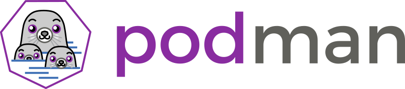

# O que é Podman

O Podman é uma ferramenta nativa do Linux sem daemon, de código aberto, projetada para facilitar a localização, execução, criação, compartilhamento e implantação de aplicativos usando contêineres e imagens de contêiner da Open Containers Initiative ( OCI ) . O Podman fornece uma interface de linha de comando (CLI) familiar para qualquer pessoa que tenha usado o Docker Container Engine . A maioria dos usuários pode simplesmente alias Docker para Podman ( alias docker=podman ) sem problemas. Semelhante a outros Container Engines comuns (Docker, CRI-O, containerd), o Podman conta com um Container Runtime compatível com OCI(runc, crun, runv, etc) para fazer a interface com o sistema operacional e criar os contêineres em execução. Isso torna os contêineres em execução criados pelo Podman quase indistinguíveis daqueles criados por qualquer outro mecanismo de contêiner comum.

Os contêineres sob o controle do Podman podem ser executados pelo root ou por um usuário sem privilégios. O Podman gerencia todo o ecossistema de contêineres que inclui pods, contêineres, imagens de contêiner e volumes de contêiner usando a biblioteca libpod . O Podman é especializado em todos os comandos e funções que ajudam você a manter e modificar imagens de contêiner OCI, como puxar e marcar. Ele permite criar, executar e manter esses contêineres e imagens de contêiner em um ambiente de produção.

Existe uma API RESTFul para gerenciar contêineres. Também temos um cliente Podman remoto que pode interagir com o serviço RESTFul. Atualmente, oferecemos suporte a clientes em Linux, Mac e Windows. O serviço RESTFul é suportado apenas no Linux.

Se você é completamente novo em contêineres, recomendamos que você confira a Introdução . Para usuários avançados ou vindos do Docker, confira nossos Tutoriais . Para usuários avançados e contribuidores, você pode obter informações muito detalhadas sobre a CLI do Podman consultando nossa página Comandos . Por fim, para desenvolvedores que desejam interagir com a API do Podman, consulte nossa Referência de documentação da API .
