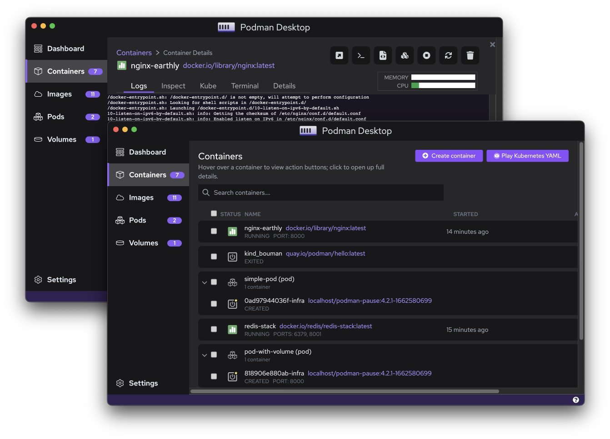

# Podman Desktop

O Podman Desktop é uma interface gráfica que permite que os desenvolvedores de aplicativos trabalhem perfeitamente com contêineres e Kubernetes.

O Podman Desktop instala, configura e mantém o Podman atualizado em seu ambiente local. Ele fornece uma bandeja do sistema para verificar o status e interagir com seu mecanismo de contêiner sem perder o foco de outras tarefas. O aplicativo de desktop fornece um painel para interagir com contêineres, imagens, pods e volumes, mas também configura seu ambiente com seus registros OCI e configurações de rede. O Podman Desktop também fornece recursos para conectar e implantar pods em ambientes Kubernetes.

